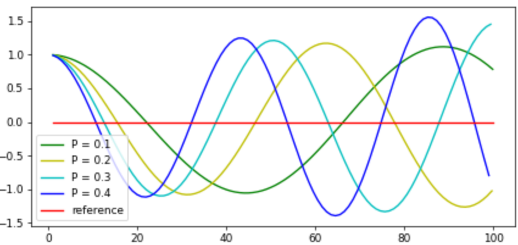
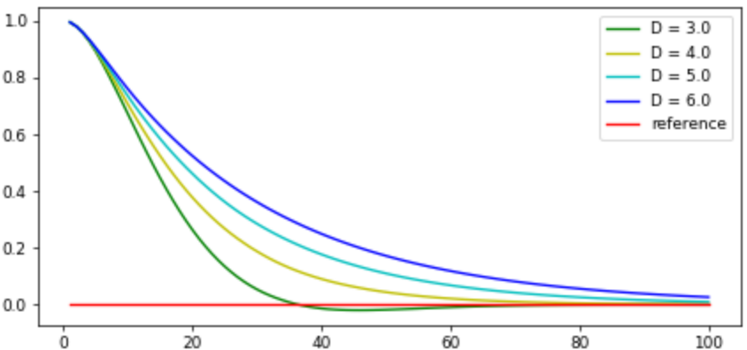
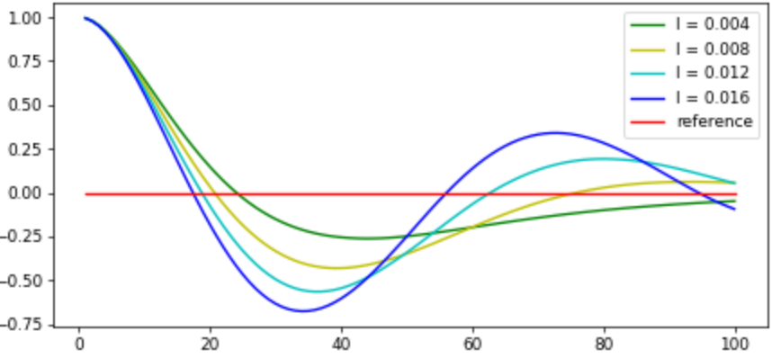

# CarND-Controls-PID
The pid control model is described in detail in this document. The steps also commented in code. 
### Goals
Fine tune the P, I, D component of the PID algorithm to steer the vehicle safely while as fast as possible.

---
### PID procedure
Manually tune the parameters until the vehicle stable, meaning it dose not oscillate in a growing magnitude and eventually run out of the lane, and then start fine tune the steering controller using twiddle. For the throttle controller, the PID parameter is fixed without twiddling.

#### PID Hyperparameter: 
* `kp` proportion gain
* `ki` integration gain
* `kd` derivative gain
* `target speed` from 30 to 100 MPH (set 50 MPH)
#### Twiddle Hyperparameter:
* `dp` respective increments for each gain
* `loop` number of loops to update pid parameters and calculate error.
#### Enabling twiddle
modify `main.cpp` line# 79:
```cpp
pid.UpdateError(cte); // disable as default 
pid.UpdateError(cte, true);
```
#### steering
The goal is keep the cross track error (CTE) to be as small as possible, using the parameter `p = 0.2, i = 0.004, d = 3.0` from the [reference](https://classroom.udacity.com/nanodegrees/nd013/parts/b9040951-b43f-4dd3-8b16-76e7b52f4d9d/modules/85ece059-1351-4599-bb2c-0095d6534c8c/lessons/48c5e9c4-f72b-4c7c-8375-ea4eda220e39/concepts/d9a5a2bc-2884-4806-a0d4-b7926bf229be), the vehicle can run stable with a speed around 30 MPH. But when the speed is faster, the vehicle will run out of the lane because the oscillation is enlarged. Proper parameters were not found when the speed was higher than 60 MPH, so the target speed was set to 50 MPH. Using 20% of original value, `p = 0.04, i = 0.0008, d = 0.6`, the vehicle stops oscillating, but the steer for sharp turn was slightly not enough. Then using twiddle to fine tune the parameters with `dp` as 50% of initial `p, i, d`.

The error is heavily affected by vehicle speed. When using the constant 0.3 throttle the average cte^2 can be as low as 1e-05 using `dp` as 10% of `p = 0.2, i = 0.004, d = 3.0`. When the target speed set to 50 MPH, the error reduced from 0.54122 to 0.0475782 after 186 iterations.

#### throttle
The throttle was set to constant 0.3 and resulting speed was around 30 MPH. 50 MPH was chosen as target speed. In order to decelerate when turning, the target speed is multiplied with `cos(θ)`, theta is the vehicle turning angle(`main.cpp` line# 80). Because the throttle is between `[0, 1]`, the PID gain should be small to make the output in the same range as the throttle is, or the value will be clipped, and the car may be accelerating in full throttle all the time. The `d` gain controls the vehicle accelerating bias, which is indispensable or there will be steady state error with target speed. Using 10% of original value, `p = 0.02, i = 0.0004, d = 0.3`, the speed is able to maintain around target speed 50 MPH.
### the effect of the P, I, D component
P value controls the proportion of instantaneous  cross track error (CTE) to correct on the next loop.
The larger P cause the overshoot larger and the vehicle will likely to oscillate with zigzag movement.

When P gain is too small, the steering angle changes too slow, so the vehicle can not make a sharp turn. We can gently increase P gain until the vehicle start to oscillate in a nearly constant amplitude but still stay in the lane.

D value controls the derivative of CTE contributes to the output. When the CTE becoming smaller, meaning a negative derivation, D part will add opposite positive to CTE, and that makes the output change slower. Given a fixed P value, larger D creates slower stabling time.

When D is too large, the derivate of CTE dominate the output and will cause the output oscillate between upper and lower limit rapidly and that makes the vehicle moving vary slow.

I value controls the integration of the CTE to eliminate the steady-state error caused by system bias. Summing up all past CTE significantly affect the output even with small changing I value, and may cause oscillation.
  

### fine tune PID with twiddle
Using [twiddle](https://classroom.udacity.com/nanodegrees/nd013/parts/b9040951-b43f-4dd3-8b16-76e7b52f4d9d/modules/85ece059-1351-4599-bb2c-0095d6534c8c/lessons/48c5e9c4-f72b-4c7c-8375-ea4eda220e39/concepts/34d4a65f-44d9-462f-b246-c2e653a19c1d) algorithm for parameter optimization, in which twiddle is used for offline tuning with a bicycle model for motion prediction, and it uses `distance` instead of `velocity` by assuming `delta_t` to be 1, and we can reuse that to tune by adjusting the speed:
```py
def run(robot, params, n=100, speed=100): #speed = 100 MPH
    distance = speed/100 # sampling rate = 100 hz
    ## the rest omitted
    robot.move(steer, distance)
    ## the rest omitted
```
The form considering `delta_t` is more understandable, which has been used in the [particle filter project](https://github.com/kaorusha/CarND-Kidnapped-Vehicle-Project). 

The equations calculating the vehicle's next positions with reference point at the rear wheel center, given input velocity and steering angle.
```cpp
// R: instantaneous turning radius
// L: vehicle length
R = L/tan(steer_angle);
// velocity: measured at the rear wheel center
yaw_rate = velocity/R;
if (fabs(yaw_rate) > 0.0001) {
      vehicle.x += velocity / yaw_rate *
                        (sin(vehicle.theta + yaw_rate * delta_t) -
                         sin(vehicle.theta));
      vehicle.y += velocity / yaw_rate *
                        (cos(vehicle.theta) -
                         cos(vehicle.theta + yaw_rate * delta_t));
      vehicle.theta += yaw_rate * delta_t;
    } else {
      // discard yaw_rate noise
      // small yaw_rate the vehicle moves as straight
      vehicle.x += velocity * delta_t * cos(vehicle.theta);
      vehicle.y += velocity * delta_t * sin(vehicle.theta);
    }
```
The simulator gives the input `steer_angle` and `velocity`, but lock of `vehicle_length`, and `delta_t`. One way is to record `delta_t` with assuming `vehicle_length`, record the errors. The offline twiddle uses `gaussian noise` to simulate the `steering_noise` and `distance_noise`, but the noise distribution might be different from simulator so the result may be too idealistic. And the calculating capability also limits the number of iteration.

Another is to use online twiddle. After choosing a initial parameter(from offline twiddle), record error after a number of `loop` and determine the next run. For fast iterating the parameter, `loop` should not be too much. But less sample cause the error estimation unreliable. It's a dilemma.(10 `loop` was chosen in `PID.cpp` line# 10)

In another hand, The fast the speed is, the small the increment value, `dp`, should be chosen, enable to keep the motion stable. But which also limit the range of searching. (50% of initial parameter was chosen in `PID.cpp` line# 55)